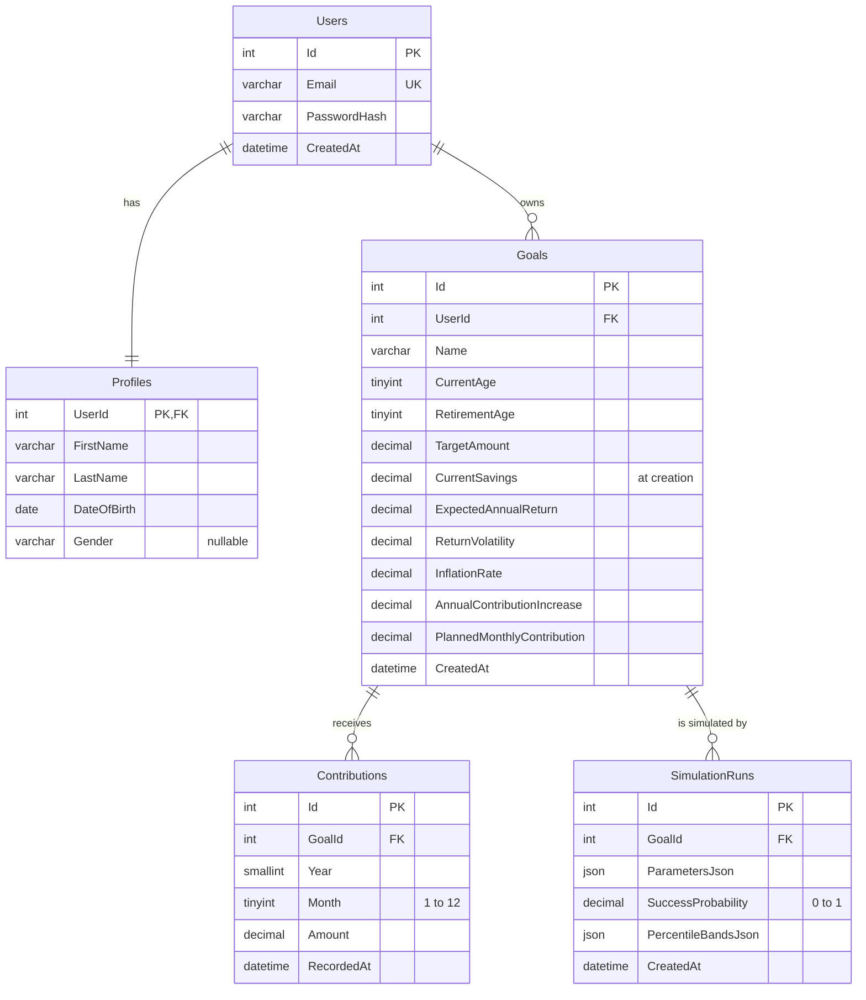

# Database

Retirement Planner stores its data in MySQL 8. The schema is defined by versioned SQL migrations in
`backend/RetirementPlanner.Api/Migrations`. The migration files are embedded in the API assembly and
applied by [DbUp](https://dbup.readthedocs.io/) when the API starts.

## Entity relationships

## Migrations

| Script | Creates |
|---|---|
| `V001__create_users_and_profiles.sql` | `Users`, `Profiles` |
| `V002__create_goals.sql` | `Goals` |
| `V003__create_contributions.sql` | `Contributions` |
| `V004__create_simulation_runs.sql` | `SimulationRuns` |

- Scripts run in name order, and each one runs once. DbUp records applied scripts in the `schemaversions` table.
- To change the schema, add a new `V005__description.sql`. Never edit a script that has already run on a shared database.
- If a script fails, the API refuses to start.
- The Docker init script (`docker/mysql-init/01_create_database.sql`) only creates the empty database.

## Design decisions

**Migrations instead of init scripts and stored procedures.** The old `database/*.sql` scripts ran only when a
container was first created, so existing databases never received schema changes. Versioned migrations bring
every database, including test containers, to the same version on startup. The queries now live in the
repositories as parameterised SQL, next to the code that uses them. That makes them reviewable and testable
in one place.

**Users and Profiles are split, 1:1 with a shared key.** Credentials (`Users`) and personal details (`Profiles`)
change for different reasons and will be protected differently once authentication arrives. `Profiles.UserId`
is both the primary key and the foreign key, so the database itself enforces "at most one profile per user"
without an extra unique index. The API's `profileId` is this user id.

**Unique email and a password hash.** Email is the login identifier, so it is unique and has a simple format
check. Passwords are stored only as hashes produced by ASP.NET Core's `PasswordHasher`, never as plain text.

**Date of birth instead of age.** A stored age goes stale every year. Age is computed from `DateOfBirth` when
it is needed.

**Gender is optional free text.** It is informational only, so it is a nullable `VARCHAR(30)` with no list of
allowed values. Users can describe themselves in their own words or leave it blank.

**Many goals per user.** `Goals.UserId` is a plain foreign key with an index on `(UserId, CreatedAt)`, so
the schema can hold several goals per user, and "latest goal for a user" is an index lookup. The API still
allows one goal per user until the frontend supports several.

**Goals carry their simulation inputs.** Expected return, volatility, inflation and yearly contribution
increase are stored per goal, so a simulation can be reproduced from the goal alone. Rates are stored as
fractions (`0.0600` = 6 %) in `DECIMAL(6,4)`. CHECK constraints keep them in plausible ranges, and keep the
retirement age after the current age.

**Current savings are derived, not updated in place.** `Goals.CurrentSavings` is the amount saved when the
goal was created and never changes. The savings the API reports are that amount plus the sum of the goal's
contributions. Because there's no running total to keep in step, a failed or repeated write can't make the
total drift from the contribution history.

**One contribution per goal and month.** `UNIQUE (GoalId, Year, Month)` stops a month from being recorded twice,
even when two requests race. `CHECK (Month BETWEEN 1 AND 12)` and `CHECK (Amount > 0)` reject impossible rows
at the source. The unique key also serves lookups by goal, so it needs no separate index.

**Simulation results as JSON.** A run's parameters and percentile bands are written once and always read as
a whole, and their shape belongs to the simulation service. JSON columns keep that shape out of the relational
schema. `SuccessProbability` stays a real column so it can be queried and constrained (0 to 1).

**Money as DECIMAL.** Amounts are `DECIMAL(18,2)` to avoid binary floating-point rounding errors.

**Cascading deletes.** Deleting a user removes their profile, goals, contributions and simulation runs.
Nothing is left orphaned, and account deletion is a single statement.

**Named constraints.** Every primary key, foreign key, unique key and check has an explicit name (`PK_`, `FK_`,
`UQ_`, `CK_`, `IX_`), so errors and later migrations can refer to them reliably.

**Demo data is seeded in code, not in a migration.** Migrations run in every environment, and demo credentials
must not. `DevelopmentDataSeeder` runs only in the Development environment. It is idempotent and creates
`demo@example.com` / `demo123` through the same repositories and password hasher as the application.

## Data access

- `IDbConnectionFactory` is the only place that creates a MySQL connection.
- `IUnitOfWork` is scoped to one HTTP request. It opens one connection on first use and optionally runs a
  transaction. Every repository in the request shares that connection and transaction, so a service can
  make several repository calls atomically with `ExecuteInTransactionAsync`.
- Repositories use Dapper with parameterised SQL and let exceptions propagate. Any unhandled error becomes an
  RFC 7807 ProblemDetails response through the global exception handler.
